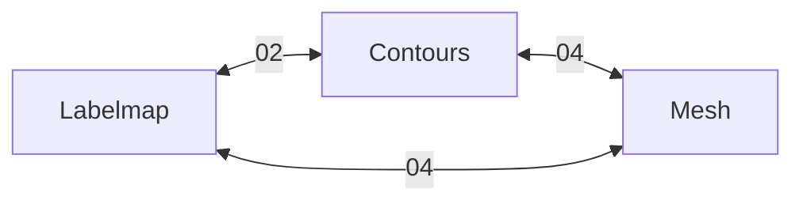

# Polymorph Segmentation Architecture

Based on [PolySeg](https://github.com/PerkLab/PolySeg). This is the **core design** - other docs implement specific pieces.

## Key Concept

One segment, **multiple representations**, with **lazy conversion**:

```
Segment "Liver"
├── source: Contours ◄── (editable)
├── labelmap: None (dirty) 
├── contours: ContourData {...}
└── mesh: MeshData {...} (cached)
```

## Conversion Graph



Numbers reference implementation docs.

## Source Representation

The **source** is the editable representation. Tool → Source mapping:

| Tool | Source | Why |
|------|--------|-----|
| Brush | Labelmap | Direct voxel edit |
| Contour Edit | Contours | Direct point edit |
| Mesh Sculpt | Mesh | Direct vertex edit |

When source changes, derived representations are **invalidated** and lazily reconverted.

## Real-Time Sync Strategy

For interactive editing with synchronized 2D/3D views:

1. **Preview mode**: Approximate during drag, full convert on release
2. **Regional updates**: Only reconvert affected slices  
3. **Dual working reps**: For deform tools, both contours+mesh live during edit

See implementation docs for details.
