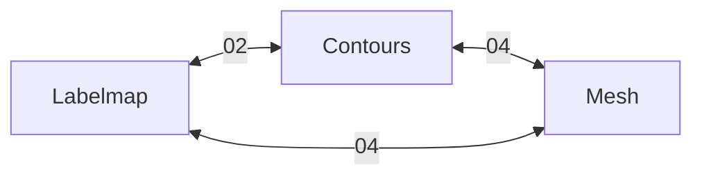

# Polymorph Segmentation Feature

Multi-representation segmentation system based on [PolySeg](https://github.com/PerkLab/PolySeg).

## Design Documents

| # | Doc | Focus |
|---|-----|-------|
| 00 | [polymorph-architecture](00-polymorph-architecture.md) | Core design: conversion graph, source switching |
| 01 | [segment-model](01-segment-model.md) | `Segment` struct with lazy representations |
| 02 | [labelmap-contour-convert](02-labelmap-contour-convert.md) | Marching Squares, rasterization |
| 03 | [contour-rendering](03-contour-rendering.md) | SDF polyline shader |
| 04 | [mesh-generation](04-mesh-generation.md) | Marching Cubes, slice extrusion |
| 05 | [mesh-rendering](05-mesh-rendering.md) | WGPU mesh pipeline |
| 06 | [contour-editing](06-contour-editing.md) | Interactive tools, source switching |

## Conversion Graph



## Implementation Order

```
01 → 02 → 03 → 06  (contour path)
   ↘ 04 → 05       (mesh path)
```
