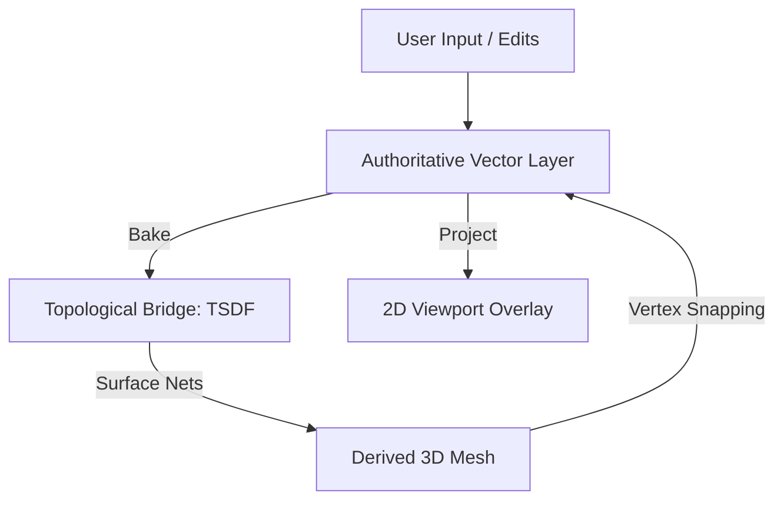

# Vector-Authoritative Segmentation Architecture

This architecture generalizes slice-based contouring into a fully 3D, axis-agnostic constraint system. It intentionally decouples **geometric precision** from **topological resolution**.

## Core Principle

> **Contours are authoritative geometric constraints; the signed distance field (TSDF) is a topological solver and universal translator.**

This architecture supports contours drawn on axial/coronal/sagittal slices, oblique planes, or in arbitrary views. All contour types are treated uniformly as spatial constraints in 3D, not as slice indices.

## Architecture Overview



### Architectural Tiers

1.  **Authoritative Spatial Contours (Vector Layer)**
    User edits are stored as floating-point vector geometry embedded in 3D. They provide infinite in-plane precision and represent the absolute truth of the segmentation boundary.
2.  **Topological Bridge (Constraint-Driven TSDF)**
    A Signed Distance Field is baked from the spatial contours to resolve correspondence across slices, handle topology changes (merges/splits), and guarantee watertight 3D surfaces.
3.  **Resolution-Independent Reconstruction**
    2D views render vectors directly for pixel-perfect display. 3D reconstruction uses Surface Nets as a base and then snaps vertices to the nearest authoritative vector constraints.

## Key Design Decisions

1.  **Vector Contours are authoritative** — All user edits (2D or 3D) are stored as 3D spatial constraints. The model is no longer grid-locked.
2.  **Authority Handoff via TSDF** — Voxel-based imports (NIfTI) are promoted to vectors via a TSDF intermediary. Once promoted, the vector layer becomes the primary model.
3.  **Axis-Agnostic by construction** — Support for oblique views and arbitrary-plane editing without re-architecture.
4.  **Perfect Silhouette Consistency** — Any 2D view of the 3D surface matches the vector contours exactly because they share the same source of truth and use vertex snapping.

---

## Labelmap / NIfTI Import Summary

When importing legacy voxel data, the system promotes it through the following pipeline to establish vector authority:

1.  **Labelmap → TSDF**: Convert voxel data into a physical-space signed distance field with optional smoothing to remove stair-step artifacts.
2.  **TSDF → Base Mesh**: Extract a watertight 3D surface using Surface Nets.
3.  **TSDF → Initial Vector Contours**: Slice the TSDF at initial planes to extract foundational polylines.
4.  **Handoff**: After extraction, the labelmap is no longer modified; all subsequent edits operate on the vector layer.

---

## Architectural Mechanism: The TSDF Bridge

The system reconciles vector geometry and volumetric topology through a constraint-driven baking process.

### TSDF Baking Algorithm (General Case)
For each TSDF voxel within a dirty chunk:
1.  **Spatial Query**: Find all `SpatialContour` objects whose influence radius bounds the voxel.
2.  **Planar Distance**: Compute the signed distance from the voxel to the contour's 3D plane.
3.  **In-Plane Distance**: Project the voxel position onto the plane and measure the 2D distance to the contour's polyline.
4.  **Combine**: Calculate the 3D distance by composing the planar and in-plane distances.
5.  **Aggregate**: Conservatively aggregate distances from multiple contours (e.g., using a weighted minimum) to resolve overlaps and intersections.

### Resolution & Topology Stability
*   **TSDF resolution** affects **topology stability** (e.g., preventing small holes or thin-wall collapses), not boundary accuracy.
*   **Boundary Accuracy** is maintained via **Infinite Precision Vectors** (2D) and **Vertex Snapping** (3D).

### Handling Anisotropy and Uncertainty
The `influence` radius of a spatial contour encodes spatial uncertainty:
*   **Axial Slices**: Typically use `influence ≈ slice_spacing / 2` to interpolate between planes.
*   **Oblique/High-Res**: May use much smaller, local influence for hard geometric constraints.
The TSDF blends these constraints smoothly, removing the "staircase" artifacts inherent in discrete voxel grids.

---

## Why This Architecture?

*   **Axis-Agnostic**: All contours are 3D constraints; no concept of a "primary" slice direction.
*   **Edit Stability**: No grid-snapping or voxel jitter during fine edits.
*   **Perfect Silhouette Consistency**: Any 2D slice of the 3D surface perfectly matches the vector geometry.
*   **Robust Topology**: The TSDF act as an "oracle" that handles complex merges and splits automatically.

---

## Performance and Scalability Path

1.  **CPU (Current Implementation)**:
    *   Sparse, chunk-based TSDF updates (32³ chunks).
    *   Incremental Surface Nets (only re-mesh dirty regions).
2.  **GPU (Future Optimization)**:
    *   **Vector → TSDF baking** via compute shaders.
    *   **Mesh vertex snapping** via vertex shaders.
The architecture scales from basic axial workflows to high-performance, fully oblique editing without architectural shifts.

---

## Relationship to Lofting

Lofting is **not** the foundational mechanism of this system. The TSDF handles all correspondence and topology naturally. Lofting may be used optionally as a post-process for CAD-style exports or specialized anatomical structures (e.g., vessel tree reconstruction).

---

## Data Representations

### Vector Layer (Source of Truth)
```rust
pub struct SpatialContour {
    pub plane: Plane3,           // 3D orientation
    pub polyline: Vec<Vec3>,     // 3D vertices
    pub influence: f32,          // Spatial falloff radius (uncertainty)
    pub label_index: u8,
}

pub struct VectorContourSet {
    pub contours: Vec<SpatialContour>,
}
```

### TSDF (Topological Bridge)
```rust
pub struct ChunkedTSDF {
    pub chunks: HashMap<(i16, i16, i16), Chunk>,  // 32³ i8 chunks
}
```

### Derived Mesh
```rust
pub struct SegmentationMesh {
    pub vertices: Vec<Vec3>, // Snapped to vectors
    pub normals: Vec<Vec3>,
    pub indices: Vec<u32>,
}
```

---

## Tool Categories

| Tool | Modifies | Sync Path |
|------|----------|-----------|
| Freehand, Polygon, Spline | Vector Layer | → Bake TSDF → Update Mesh |
| Contour Drag (3D) | Vector Layer | → Bake TSDF → Update Mesh |
| Sculpt (3D) | Vector Layer | → Bake TSDF → Update Mesh |
| Threshold | (Global) | Affects TSDF Baking weights |

## Implementation Roadmap

The implementation is broken down into four phases:
1. **[Legacy Import](file:///Users/nieage/dev/git/rust_starter_app/docs/features/vector_plans/phase_1_import_plan.md)**: Promoting voxels to vectors.
2. **[Vector Layer](file:///Users/nieage/dev/git/rust_starter_app/docs/features/vector_plans/phase_2_vector_layer_plan.md)**: 3D storage and dynamic 2D projection.
3. **[TSDF Baking](file:///Users/nieage/dev/git/rust_starter_app/docs/features/vector_plans/phase_3_baking_plan.md)**: Reconciling vectors into a volumetric field.
4. **[Mesh Snapping](file:///Users/nieage/dev/git/rust_starter_app/docs/features/vector_plans/phase_4_snapping_plan.md)**: Ensuring perfect mesh/contour agreement.

---

## Related Documents

- [Milestones](./segmentation_milestones.md) — Progress tracking
- [PolySeg Original](./polyseg.md) — Initial project context
