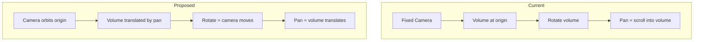

# 3D Slicer-Style Rotation (Fixed Pivot at Screen Center)

> **Status**: Proposed Feature

## Overview

This document describes a proposed change to the 3D viewport rotation behavior to mimic **3D Slicer**.

## Current Behavior

- Camera is fixed at `z = -3.5`
- Volume rotates around its own center (turntable style)
- Pan scrolls into the volume (like a 2D image)
- **Effect**: Volume center always stays at screen center

## Proposed Behavior (3D Slicer-style)

- Camera **orbits around a fixed pivot** at screen center (world origin)
- Pan **translates the volume** in world space
- **Effect**: If you pan the volume off-center and rotate, it swings in an arc around the screen center

```
If volume is panned right and user rotates:

    ╔═╗                    ╔═╗
    ║█║      rotate →       ║█║
    ╚═╝                      ╚═╝
         •                 •
      (pivot)           (pivot)

Volume swings around the fixed pivot point
```

## Technical Implementation

### Architecture Change



### Shader Changes (`shader.wgsl`)

Replace the current fixed-camera approach with orbiting camera:

```wgsl
// === Camera orbits around origin ===
let cam_pos = rot_mat * vec3<f32>(0.0, 0.0, -radius);

// Derive camera basis (always looks at origin)
let forward = normalize(-cam_pos);
var world_up = vec3<f32>(0.0, 1.0, 0.0);
// Handle singularity when looking straight up/down
if abs(dot(forward, world_up)) > 0.99 {
    world_up = vec3<f32>(0.0, 0.0, 1.0);
}
let right = normalize(cross(forward, world_up));
let up = cross(right, forward);

// Ray direction in world space
let ray_dir = normalize(forward + right * screen_pos.x + up * screen_pos.y);

// === Volume is translated in world space ===
let pan_scale = 2.0;
let volume_offset = right * pan.x * pan_scale + up * pan.y * pan_scale;

// AABB in world space (offset by pan)
let box_min = volume_offset - 0.5 * aspect_ratio_vol;
let box_max = volume_offset + 0.5 * aspect_ratio_vol;

// Raymarch in WORLD space
let t_hit = intersectAABB(cam_pos, ray_dir, box_min, box_max);
```

### Picking Changes (`picking.rs`)

Mirror the shader logic for CPU-side 3D picking:
1. Camera position from `rot_mat * [0, 0, -radius]`
2. Derive `forward`, `right`, `up` from camera position
3. Volume AABB offset by pan
4. Raymarch in world space

### Crosshair & Overlay Projection

Update projection logic to use the orbiting camera model.

## Files to Modify

| File | Changes |
|------|---------|
| `src/shaders/shader.wgsl` | Revamp 3D camera setup, raymarching, crosshair/overlay projection |
| `src/systems/picking.rs` | Mirror shader logic for CPU-side 3D picking |
| `src/systems/input.rs` | Potentially adjust pan sensitivity |

## Verification

1. **Centered rotation**: Don't pan, just rotate → volume spins in place (same as before)
2. **Off-center rotation**: Pan right, then rotate → volume swings in arc
3. **3D picking**: Click in 3D → crosshair places correctly
4. **Crosshair rendering**: Verify 3D crosshair works after rotation

## Notes

- When camera is directly above/below, use fallback up vector `(0,0,1)` to avoid gimbal lock
- May want to add "reset view" button to re-center volume
